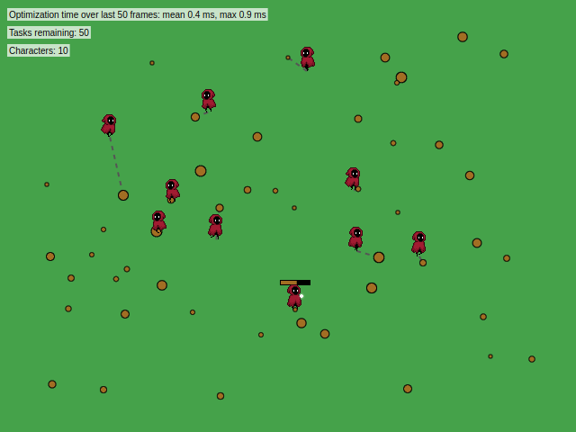

# LibColony


LibColony is a C++ (and JavaScript) library for task sheduling, perfect for colony simulation games like Rimworld or Dwarf Fortress. LibColony reduces the need for micromanagement, increases autonomy of colonists and prevents spirals of death. As a result the player can focus on planning rather than firefighting.

## Demo

<a href="https://mrogalski.eu/libcolony/"><br>view the demo at mrogalski.eu/libcolony</a>

## Introduction

### Colony simulators

Gameplay in games like Dwarf Fortress or Rimworld usually involves planning a colony - the layout of buildings, workshops and houses. This is done with a great deal of freedom. For example, we can decide that our colony will be an isolated toy factory, an inn on a popular trade route, or a bandit camp.

One of the most interesting elements that distinguishes this genre of games is that the built colony can actually be left alone. Its inhabitants take care of their own needs. The player can take on the role of a passive observer - like in an ant colony - following the fate of his subjects.

### Death spiral

At least that's how it looks in theory. In practice, colonies are often annihilated for trivial reasons. Most often revolts caused by unmet needs of colonists - lack of food, protection from the elements or growing frustration. Tasks essential to the operation of the colony, such as maintaining fortifications or producing food, are routinely neglected.

Problems tend to develop in spirals - they start with a single disgruntled character who destroys something in anger, spoiling the mood of subsequent colonists. Therefore, player intervention is constantly needed, reminding colonists what to do, and putting out fires while they are still manageable.

This mechanism, known as the <em>death spiral</em>, follows a certain well-known pattern. It relies on the fact that minor incidents generate additional tasks - both completely unimportant and <em>vital</em> to the survival of the colony. The insignificant tasks immediately consume the colonists, while the few vital tasks remain unperformed. This causes problems to grow and inevitably leads to further incidents. Chaos ensues.

What becomes clear is that the problem is primarily the way tasks are assigned to colonists. It involves a character who has free time checking a list of tasks and choosing something from it for themself. In doing so, it does not take into account the tasks performed by other characters. The decision is made "locally", based on a schedule and the work rules set by the player - that's why this approach is called "greedy". The selected task is reserved (reservations prevent other characters from taking over the task). The colonist then performs it until something gets in his way, or until the task gets completed. This simple and seemingly obvious algorithm leads to a series of problems and is the basis of the death spiral.

Given the above problems, and the fact that the intervention of a player directing the colonists' movements meticulously can prevent a death spiral, we can make the following claim:

<strong>An appropriate assignment algorithm can counteract death spirals on an ongoing basis by meeting the needs of colonists and repairing the effects of minor incidents.</strong>

In other words - do exactly what a firefighting player does.

A few years ago, while taking part in a programming competition (and winning 😎) I had the opportunity to write a program that flexibly assigns such tasks. Therefore, I decided to dig up the old code, develop it and release it as a library. I provide a description of its operation, and the source code (under the MIT license) below.</p>

### Problems of greedy task allocation

Greedy assignment of tasks leads to several problems. Let's list them:

1. During work, colonists do not take breaks and completely ignore their needs. Long tasks significantly increase their frustration.
2. A colonist reserving a task for himself prevents other, better positioned colonists from taking over. Therefore, even if a colonist is at the other end of the map and faces a long trek, he will not give the task to another colonist idling nearby.
3. A group of small tasks located far from the colony often results in the escapade of entire groups of colonists (each reserving one of the distant tasks for themselves). Despite the fact that it would be enough for one of them to go.
4. Some colonists are simply better at certain tasks than others. In order for the greedy algorithm to assign them the right jobs, the player must create appropriate work rules that prohibit the others from the given jobs. Such rules must be updated as colonists join and leave the colony, requiring constant intervention by the player.
5. Minor tasks, are often ignored by colonists who pass right by them and could have done them virtually immediately. Instead, they are left for later - and then require another colonist to make a long trip to the site.
6. A colonist with special requirements, such as needing more entertainment at the moment, has the same amount of free time as others. Such colonists require special care from the player, who adjusts their time accordingly.

## LibColony algorithm

### Performance

One of the most important factors for gamedev libraries is their speed. If they are not fast enough, game developers will rewrite them for their own use in a more efficient way. That's why LibColony is written in high-performance C++, with the ability to call from other languages. For the demonstration at mrogalski.eu, I wrote the corresponding interface in JavaScript. This way it can be used both in games written in C++ and in games written in JavaScript.

The algorithm itself avoids any allocations, operating only on the stack, as well as any system calls. In this way, it avoids both of the biggest sources of slowdown, and makes efficient use of the processor's cache.

### Recalculation every frame

Thanks to its high performance, LibColony is able to recalculate task assignments multiple times (yes!) per frame of animation, even when the number of colonists and tasks reaches hundreds. This allows colonists to react immediately to changes in the game world, as well as for (described later) long-term planning.

### Uniform treatment of needs and tasks

LibColony satisfies colonists' needs by treating them analogously to tasks. As a character's need grows in importance, its priority gradually increases. As a result, colonists are able to interrupt work to meet their needs. The distance from where the need is met is also taken into account. By this, for example, colonists who work near the kitchen will eat more often than colonists working in remote corners of the colony.

In general, the following are taken into account:

* travel time to the task location
* time to complete the task
* risk of failure, after which a repeat of the task will be required
* relative priority/importance of the task

The last element is particularly important because it allows game developers to distinguish key tasks from unimportant ones. This can include, for example:

* whether a given cleaning task is located in a place where colonists frequent, or is far away from them (and thus less important)
* whether adequate food supplies are available, or whether food is running out (and thus cooking tasks are more relevant)
* the value / rarity of war spoils to be collected from the battlefield
* etc. etc.

Each of these elements can take on different values for each colonist and change over time.

### Hungarian algorithm

The heart of the algorithm is the <a href="https://en.wikipedia.org/wiki/Hungarian_algorithm">Hungarian algorithm</a>, which guarantees optimal assignment of tasks to characters. Its complexity is O(n^3), although LibColony offers an optional (and rarely required) optimization that limits the number of assignments considered, so that the complexity drops to O(n^2).

### Delivery scheduling

To schedule delivery tasks, the algorithm can be run twice. In the first run, it assigns items to locations where they are to be delivered. This allows it to determine the delivery cost for each item (while minimizing the total time for all deliveries). Then the algorithm is run again, this time assigning delivery tasks to the colonists who are to deliver them.

### Long-term planning

Sometimes a single colonist can independently complete many tasks faster than many (slower) colonists. For example, when several small tasks occur in a remote location, a nearby colonist can complete them all faster than a group of colonists running from the other end of the map.

This requires planning many tasks ahead, and LibColony can also help with this.

To do this, first assign tasks in the usual way. This initial assignment will assign tasks to all available colonists - both nearby and distant. The trick is that the task that is completed first in this assignment is marked as completed; the colonist who completed it is moved (virtually) to the place where the task was completed, and the cost of all the tasks they can perform is increased by the cost of completing this just-completed task.

The tasks are then assigned again and the whole process is repeated. The task completed first is marked as completed and the position and times of the other tasks of the colonist who completed it are corrected. This process can be repeated as many times as desired (within a certain time budget or until all tasks are completed).

The final long-term plan consists of the tasks that were completed during this process (assigned to colonists who completed them), followed by the tasks that were assigned to colonists in the last run of the algorithm.

## Download

LibColony is available under the MIT license. The latest version can be downloaded from the <a href="https://github.com/mafik/libcolony/releases">Releases</a> page.

The C++ library is a single header that should be linked in (preferably) one translation unit. All functions are available in the `colony` namespace.

The JavaScript library wraps C++ code compiled as WebAssembly. Version 1.0, built for browsers, can be downloaded from <a href="colony_js.zip">here</a>. All provided functions are described in the <a href="https://github.com/mafik/libcolony/blob/main/src/colony_js_post.js">colony_js_post.js</a>. To use the library, you can use the following sample code:

```html
<script>
  var Module = {
    onRuntimeInitialized: function() {
      window.requestAnimationFrame(tick);
    }
  };

  function tick() {
    let assignments = [{ character: "John", task: "clean blood", cost: 10 },
                       { character: "Fred", task: "clean blood", cost: 15 },
                       { character: "John", task: "construct wall", cost: 20 },
                       { character: "Fred", task: "construct wall", cost: 10 }];
    let optimized = Module.optimize(assignments);
    console.log(optimized); // [{ character: "John", task: "clean blood", cost: 10 },
                            //  { character: "Fred", task: "construct wall", cost: 10 }]
    window.requestAnimationFrame(tick);
  }
</script>
<script src="colony.js"></script>
```
